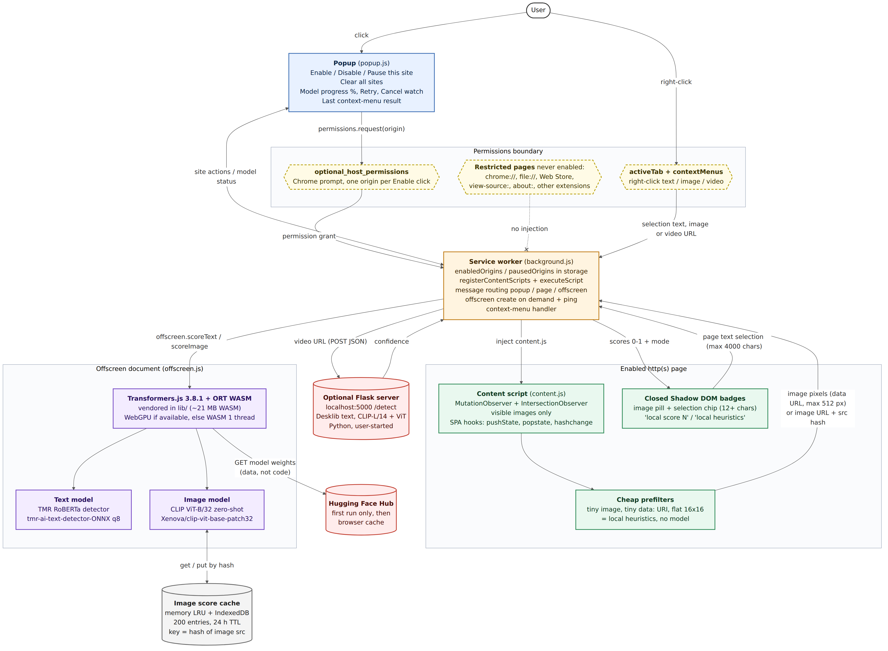

# LucidScan architecture (v0.4.0)

Source: [`architecture.mmd`](architecture.mmd) (Mermaid) · vector: [`architecture.svg`](architecture.svg). Drawn from the code at `2b99cc1` (`chrome_plugin/manifest.json`, `background.js`, `content.js`, `offscreen.js`, `popup.js`, `server.py`), not from the design notes.

## From opening a page to seeing a badge

1. Open an http(s) page, click LucidScan → **Enable badges on this site** (or `Alt+Shift+L`), and approve Chrome's permission prompt for that one site.
2. The service worker remembers the site and injects the content script there; nothing runs on sites you haven't enabled or on restricted pages like `chrome://`.
3. The content script spots images as they scroll into view and text you select (12+ characters). Tiny or flat images get a quick heuristic label instead.
4. Everything else goes to the offscreen document, where CLIP ViT-B/32 (images) or the TMR model (text) runs on your device. Models download from Hugging Face the first time, and image scores are cached for 24 h.
5. The score appears in a small badge as `local score N`: a local signal, not a verdict on authenticity.

## Components

| Component | File(s) | What it does | Data in → out |
|---|---|---|---|
| Popup | `popup.html`, `popup.js` | Enable / Disable / Pause / Resume this site, Clear all, model progress + Retry / Cancel watch, last context-menu result | User clicks → `permissions.request(origin)`, messages to SW |
| Service worker | `background.js` | Keeps `enabledOrigins` / `pausedOrigins`, `registerContentScripts` + `executeScript`, routes `scoreText` / `scoreImage`, creates the offscreen doc on demand, context menus, `Alt+Shift+L` | Page/popup messages → offscreen; scores → page |
| Content script | `content.js` | Mutation + Intersection observers (visible `` only), cheap prefilters, selection chip, closed Shadow DOM pills, history/popstate/hashchange rebinding, strip-resistance with backoff | Image data URL or URL + src hash, selected text (≤4000 chars) → SW; scores → badges |
| Offscreen document | `offscreen.html`, `offscreen.js`, `lib/` | Transformers.js 3.8.1 + vendored ORT WASM (WebGPU if available, else WASM single-thread); TMR text (q8) and CLIP ViT-B/32 zero-shot; labeled heuristic fallback | Text / image → score 0–1 + mode |
| Image score cache | `offscreen.js` | In-memory LRU + IndexedDB `lucidscan-cache`, ≤200 entries, 24 h TTL, keyed by a hash of the image src | Hash → cached score |
| Hugging Face Hub | (remote) | First-run download of ONNX weights + tokenizer/config into the browser cache | HTTP GET from the extension → model files |
| Optional Flask server | `server.py`, `detect.py`, `text_detection.py` | Power-user Python path on `localhost:5000/detect`; the extension uses it only for **Scan this video** | Video URL (POST JSON) → confidence |
| Permissions | `manifest.json` | `optional_host_permissions` (`http://*/*`, `https://*/*`, granted one origin at a time), `activeTab`, `contextMenus`, `scripting`, `storage`, `offscreen`; fixed host perms for `localhost:5000` and Hugging Face | — |

## Notes from reading the code

- The `history.pushState` / `replaceState` wrappers run in the content script's isolated world, so they only see calls made from that world. In practice, SPA navigations are picked up by the MutationObserver plus `popstate` / `hashchange`.
- If a cross-origin image taints the canvas, the content script sends the image URL instead, and the offscreen document fetches it again. That second request can fail on CORS, and when it does the badge falls back to local heuristics.
- Actual first-run download sizes, from the Hugging Face file listing on 2026-10-07: TMR `model_quantized.onnx` is about 126 MB. CLIP `model_fp16.onnx` is about 304 MB (tried first) and `model_quantized.onnx` about 154 MB. That puts a first run at roughly 280–430 MB, well above the README's "tens of MB + ~85 MB".
